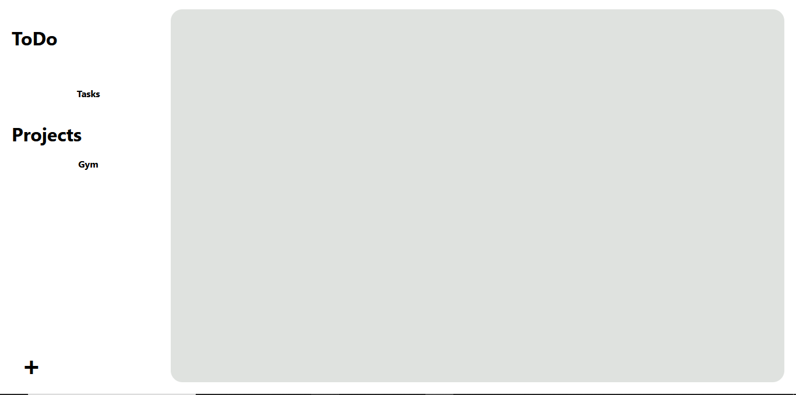
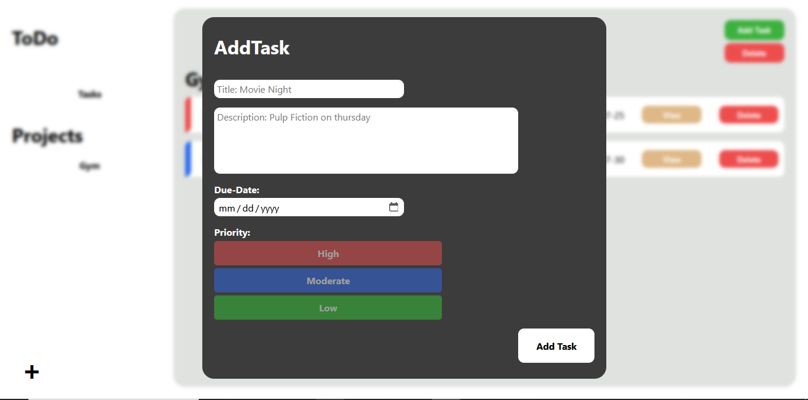
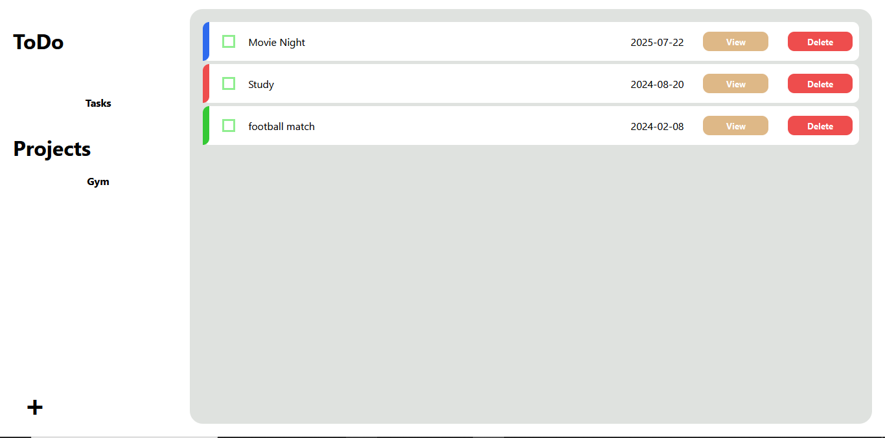
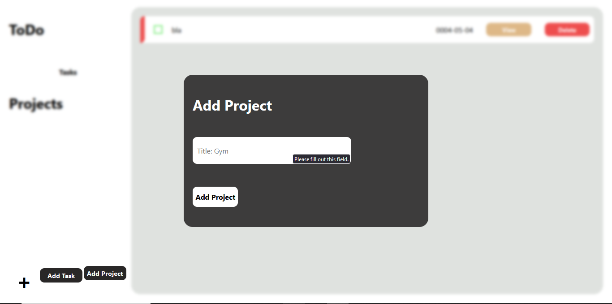
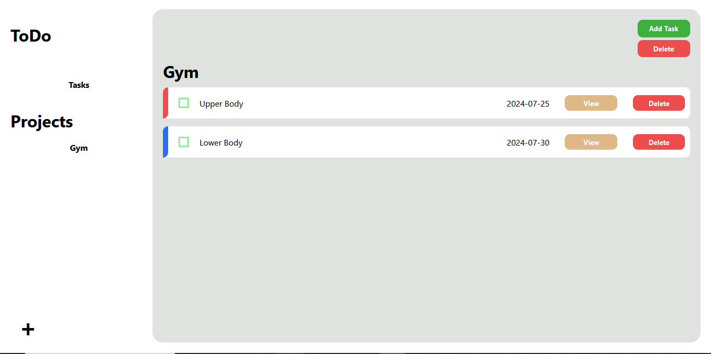

# To-do
-this To do website is part of the odin project course!

## Home page

## Tasks addition

## Tasks

## Projects addition

## Projects

## What i learned:
-Getting more familiar with building using ES6 modules

-continued learning the basic foundations of webpack and how to bundle files

-got more familiar with npm and how to manage packages

-got more familiar with npm scripts and how to automate certain tasks

-got more grasp on project directory structure and code organization